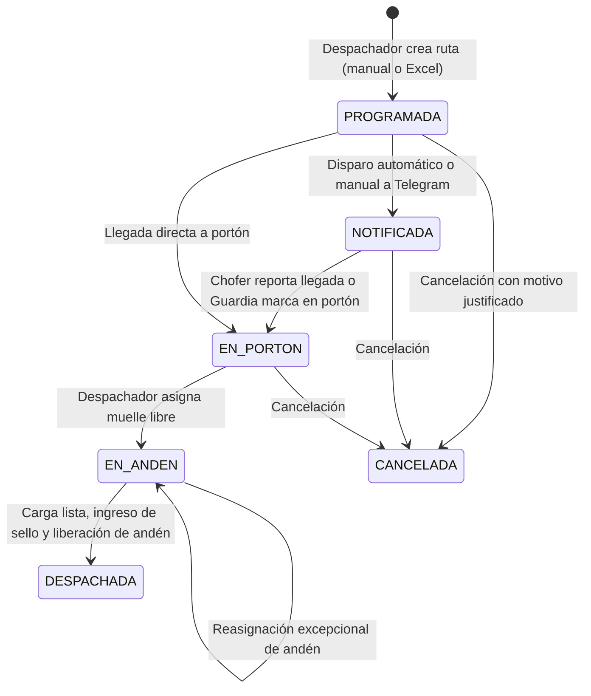

# Módulo de Logística y Control de Despacho - Hendaya

Documentación técnica y operativa del módulo de **Logística / Control de Despacho** integrado en la plataforma **Aplicaciones Hendaya**.

---

## 1. Arquitectura Técnica

- **Framework**: Next.js 16 (App Router) + React 19 + TypeScript.
- **Base de Datos**: PostgreSQL institucional mediante **Prisma ORM** (`prisma/schema.prisma`).
- **Diseño & Estilos**: Vanilla Tailwind CSS v4, componentes responsivos, soporte nativo claro/oscuro y estética corporativa oficial **HENDAYA** (Acentos Cyan `#0891b2`).
- **Motor de Integraciones**: Dispatcher asíncrono con n8n, firma criptográfica HMAC-SHA256 y Route Handlers para callbacks entrantes desde Telegram.
- **Script de Despliegue Idempotente**: `scripts/patch_logistica.js` y `scripts/assign_logistica_permissions.js`.

---

## 2. Entidades de Base de Datos (PostgreSQL)

| Tabla | Propósito |
| :--- | :--- |
| `log_bodegas` | Centros de distribución (ej: CD Metro, CD Copiapó). Vinculado a sucursales. |
| `log_andenes` | Muelles de carga físicos con código, tipo de carga y estado operativo (`DISPONIBLE`, `OCUPADO`, `BLOQUEADO`, `MANTENCION`). |
| `log_transportistas` | Empresas transportistas externas o flota interna. |
| `log_choferes` | Conductores con RUT, teléfono móvil y vinculación con `telegramChatId`. |
| `log_camiones` | Vehículos con patente única, tipo (Rampla, 3/4, Furgón) y capacidad en Kg/M3. |
| `log_clientes` | Clientes receptores de la carga con dirección y comuna. |
| `log_rutas` | Órdenes de despacho con correlativo diario (`RUT-YYYYMMDD-XXXX`), token UUID de seguimiento, bultos y sellos. |
| `log_eventos_ruta` | Bitácora cronológica inmutable de cambios de estado y origen (`DESPACHADOR`, `TELEGRAM_CHOFER`, `PORTON`, etc.). |
| `log_integracion_configs` | Configuración del webhook hacia n8n, token secreto y eventos suscritos. |
| `log_integracion_logs` | Historial técnico de envíos hacia n8n con payload, códigos HTTP y reintentos. |
| `log_parametros` | Parámetros operativos (tiempos máximos de permanencia, alertas). |

---

## 3. Ciclo de Vida de una Ruta de Despacho



---

## 4. Integración con n8n & Telegram Bot

### A. Webhook Saliente (Hendaya → n8n)
Configurable en `/dashboard/logistica/integraciones`. Cada vez que ocurre un hito (`RUTA_CREADA`, `CHOFER_NOTIFICADO`, `ANDEN_ASIGNADO`, `DESPACHO_COMPLETO`), Hendaya despacha un `POST` con la siguiente estructura:

```json
{
  "id": "uuid-evento",
  "event": "ANDEN_ASIGNADO",
  "timestamp": "2026-09-09T18:00:00.000Z",
  "ruta": {
    "numeroRuta": "RUT-20260909-0001",
    "tokenRuta": "43b05ba6-ca92-4ac5-af59-75f26fe03a9b",
    "estado": "EN_ANDEN"
  },
  "chofer": {
    "nombre": "Juan Pérez",
    "telefono": "+56912345678",
    "telegramChatId": "987654321"
  },
  "camion": {
    "patente": "ABCD12"
  },
  "anden": {
    "codigo": "AND-01",
    "nombre": "Andén 01 - Carga General"
  }
}
```

### B. Webhook Entrante (n8n → Hendaya)
Endpoint: `POST /api/logistica/webhooks/entrante/[token]`

Cuando el chofer pulsa el botón *"¡Llegué al portón!"* en el bot de Telegram, n8n envía:
```json
{
  "tokenRuta": "43b05ba6-ca92-4ac5-af59-75f26fe03a9b",
  "accion": "LLEGADA_PORTON",
  "choferTelegramId": "987654321",
  "notas": "Chofer confirmó llegada física mediante Telegram"
}
```
Hendaya valida el token, actualiza automáticamente la ruta a `EN_PORTON`, registra el evento en la línea de tiempo y lo refleja inmediatamente en el Tablero de Despacho.

---

## 5. Control de Concurrencia en Andenes
- Las asignaciones y liberaciones de andén se ejecutan bajo **transacciones atómicas** (`prisma.$transaction`).
- Si dos despachadores intentan asignar el mismo andén al mismo milisegundo, la base de datos garantiza exclusividad y el segundo despachador recibe un mensaje amigable indicando que el andén ya fue reservado.

---

## 6. Permisos del Catálogo

| Permiso | Descripción |
| :--- | :--- |
| `logistica:tablero:ver` | Ver el Tablero de Despacho en tiempo real |
| `logistica:tablero:gestionar` | Asignar, reasignar y liberar andenes |
| `logistica:rutas:ver` | Ver historial de rutas y trazabilidad |
| `logistica:rutas:crear` | Crear rutas manuales o por importación Excel |
| `logistica:rutas:editar` | Modificar datos de rutas programadas |
| `logistica:rutas:cancelar` | Cancelar o reprogramar rutas |
| `logistica:rutas:forzar_estado` | Cambio manual excepcional de estado con auditoría |
| `logistica:chofer:notificar` | Notificar al chofer por Telegram vía n8n |
| `logistica:porton:marcar` | Registrar llegada de camiones a portón |
| `logistica:despacho:completar` | Cerrar despacho con sello de seguridad |
| `logistica:metricas:ver` | Ver KPIs y gráficos de rotación |
| `logistica:rutas:exportar` | Descargar informe nativo en Excel (`.xlsx`) |
| `logistica:config:ver` | Ver mantenedores de logística |
| `logistica:config:bodegas` | Crear y configurar bodegas y andenes |
| `logistica:config:choferes` | Gestionar choferes y teléfonos |
| `logistica:config:camiones` | Gestionar flota y patentes |
| `logistica:config:transportistas` | Gestionar empresas transportistas |
| `logistica:config:clientes` | Gestionar clientes y destinos |
| `logistica:integraciones:ver` | Configurar webhooks n8n y ver bitácora de logs |
